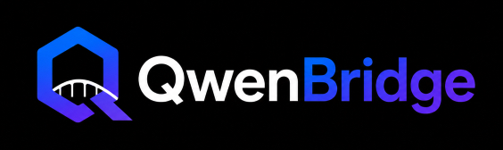

<p align="center">
  
</p>

<h1 align="center">QwenBridge</h1>

<p align="center">
  <strong>AI-native search decision engine and developer platform.</strong>
</p>

<p align="center">
  Query understanding · Safe execution planning · Pluggable retrieval · Typed streaming
</p>

<p align="center">
  <a href="#quick-start">Quick start</a> ·
  <a href="#architecture">Architecture</a> ·
  <a href="#sdks-and-starters">SDKs</a> ·
  <a href="#documentation">Documentation</a> ·
  <a href="#contributing">Contributing</a>
</p>

<p align="center">
  <a href="https://openjdk.org/">
    
  </a>
  <a href="https://spring.io/projects/spring-boot">
    
  </a>
  <a href="https://maven.apache.org/">
    
  </a>
  <a href="LICENSE">
    
  </a>
  <a href="https://www.docker.com/">
    
  </a>
  <a href="https://opensearch.org/">
    
  </a>
  <a href="https://redis.io/">
    
  </a>
</p>

<p align="center">
  <a href="qwenbridge-typescript-sdk/">
    
  </a>
  <a href="../../actions">
    
  </a>
  <a href="docs/development/code-quality.md">
    
  </a>
</p>

---

> **Current public release track:** V9 — Developer Platform

QwenBridge accepts a user query, analyzes it through an AI-first pipeline, produces a safe execution plan, runs retrieval through pluggable providers, and exposes results through REST APIs, Server-Sent Events (SSE), a Java SDK, a Spring Boot Starter, and a TypeScript SDK.

## What QwenBridge does

| Area | Capabilities |
| --- | --- |
| **Understanding** | Input normalization, language detection, intent detection, query rewrite, semantic analysis, AI decisioning |
| **Safety** | Policy evaluation, threat detection, abuse protection, secret-leakage checks, request isolation |
| **Retrieval** | Keyword, vector, hybrid search, ranking, reranking, facets, provider abstraction |
| **Developer experience** | REST API, typed SSE events, Java SDK, Spring Boot Starter, TypeScript SDK |
| **Operations** | Redis cache support, health/readiness, metrics, tracing, structured logging, Docker deployment |

##  Quick start

### 1. Start local dependencies

```bash
docker compose up -d
```

### 2. Run the server

```bash
mvn -pl qwenbridge-server spring-boot:run
```

### 3. Verify the API

```bash
curl http://localhost:8080/api/v1/health
```

### 4. Analyze a query

```bash
curl -X POST http://localhost:8080/api/v1/search/analyze \
  -H 'Content-Type: application/json' \
  -d '{"query":"best wireless headphones for travel"}'
```

For environment setup, configuration, and local prerequisites, see [Local Development](docs/development/local-development.md).

##  Architecture


QwenBridge separates **AI providers**, **search providers**, **pipeline steps**, and **execution operations** so retrieval and model integrations can evolve independently.

For the detailed architecture model, see:
[Architecture Overview](docs/architecture/overview.md),
[Pipeline](docs/architecture/pipeline.md), and
[Modules](docs/architecture/modules.md).

QwenBridge separates **AI providers**, **search providers**, **pipeline steps**, and **execution operations** so that retrieval and model integrations can evolve independently.

##  Main modules

```text
qwenbridge-server               Spring Boot runtime and public API
qwenbridge-java-sdk             Java client SDK
qwenbridge-spring-boot-starter  Spring Boot auto-configuration
qwenbridge-typescript-sdk       TypeScript client SDK
examples                        Runnable consumer examples
docs                            Architecture, API, operations, release docs
scripts                         Verification, seed, and performance tooling
```

##  AI and retrieval stack

The default local stack is provider-oriented:

- **Qwen** through Ollama for AI-assisted analysis and decisioning
- **BGE embeddings** through Ollama for vector retrieval
- **OpenSearch** for keyword, vector, and hybrid retrieval
- **Redis** for cache and rate-limiting support
- **Spring Boot** for the server runtime

Provider boundaries are documented in [AI Stack](docs/architecture/ai-stack.md) and [Provider Reliability](docs/architecture/provider-reliability.md).

##  Public API

**API version:** `v1`

| Interface | Endpoint |
|---|---|
| Search analysis | `POST /api/v1/search/analyze` |
| AI chat | `POST /api/v1/ai/chat` |
| Health | `GET /api/v1/health` |
| Version | `GET /api/v1/version` |
| Streaming | `GET /api/v1/search/stream/{requestId}` |

The streaming interface uses a stable public SSE envelope with typed payloads, including connection, pipeline, token, completion, and failure events.

- [REST API reference](docs/api/rest-api.md)
- [SSE event contract](docs/api/sse.md)

##  SDKs and starters

| Package | Purpose | Documentation |
|---|---|---|
|  Java SDK | Synchronous, asynchronous, and typed streaming clients | [README](qwenbridge-java-sdk/README.md) · [Example](docs/examples/java-sdk-example.md) |
|  Spring Boot Starter | Auto-configured Java SDK client and health integration | [README](qwenbridge-spring-boot-starter/README.md) · [Example](docs/examples/spring-boot-starter-example.md) |
|  TypeScript SDK | ESM client with retries and typed streaming | [README](qwenbridge-typescript-sdk/README.md) · [Example](docs/examples/typescript-sdk-example.md) |

##  Quality and verification

Run the complete Java build and test suite:

```bash
mvn clean verify
```

Run release verification:

```bash
bash scripts/verify-release.sh
```

The repository includes architecture rules, formatting gates, static analysis, unit tests, integration tests, retrieval-quality evaluation, and performance/resilience scripts.

- [Testing](docs/development/testing.md)
- [Code Quality](docs/development/code-quality.md)
- [Retrieval Quality Benchmark](docs/evaluation/retrieval-quality-benchmark.md)
- [Release Audit](docs/release/release-audit.md)

##  Documentation

### Build and contribution

- [Local Development](docs/development/local-development.md)
- [Testing](docs/development/testing.md)
- [Code Quality](docs/development/code-quality.md)
- [Branching and Pull Request Policy](docs/development/branching-and-pr-policy.md)
- [Contributing Guide](CONTRIBUTING.md)

### Architecture

- [Architecture Overview](docs/architecture/overview.md)
- [Modules](docs/architecture/modules.md)
- [Pipeline](docs/architecture/pipeline.md)
- [Architecture Rules](docs/architecture/architecture-rules.md)
- [Ranking Policy](docs/architecture/ranking-policy.md)
- [Retrieval Verification](docs/architecture/retrieval-verification.md)

### Operations and deployment

- [Configuration](docs/operations/configuration.md)
- [Health and Readiness](docs/operations/health.md)
- [Logging](docs/operations/logging.md)
- [Metrics](docs/operations/metrics.md)
- [Tracing](docs/operations/tracing.md)
- [Operational Runbook](docs/operations/runbook.md)
- [Docker Deployment](docs/deployment/docker.md)

### Publishing and releases

- [Release History](docs/release/README.md)
- [V9 Roadmap](docs/roadmap/V9.md)
- [V9 Release Checklist](docs/release/V9-release-checklist.md)
- [V9 Release Evidence](docs/release/V9-release-evidence.md)
- [Maven Central Publishing](docs/publishing/maven-central.md)
- [npm Publishing](docs/publishing/npm.md)
- [Release Process](docs/publishing/release-process.md)

##  Security

Please read [SECURITY.md](SECURITY.md) before reporting a vulnerability.

- [Abuse Protection](docs/security/abuse-protection.md)
- [Secrets Handling Policy](docs/security/secrets-handling-policy.md)

**Never commit** secrets, tokens, passwords, private endpoints, generated build output, dependency directories, or local environment files.

## Contributing

Contributions are welcome when they are focused, production-ready, and aligned with the QwenBridge architecture.

Every pull request must:

- target a clearly scoped problem or approved issue;
- preserve module boundaries and architecture rules;
- include appropriate unit and integration test coverage;
- pass the required CI checks, including build and test verification;
- avoid unrelated refactoring, generated files, secrets, and local environment changes;
- follow the repository formatting, static-analysis, security, and documentation standards.

Pull requests that do not meet these requirements may be closed without review.

Before opening a pull request, read the [Contributing Guide](CONTRIBUTING.md) and the [Branching and Pull Request Policy](docs/development/branching-and-pr-policy.md).

##  License

QwenBridge is licensed under the [Apache License 2.0](LICENSE).
